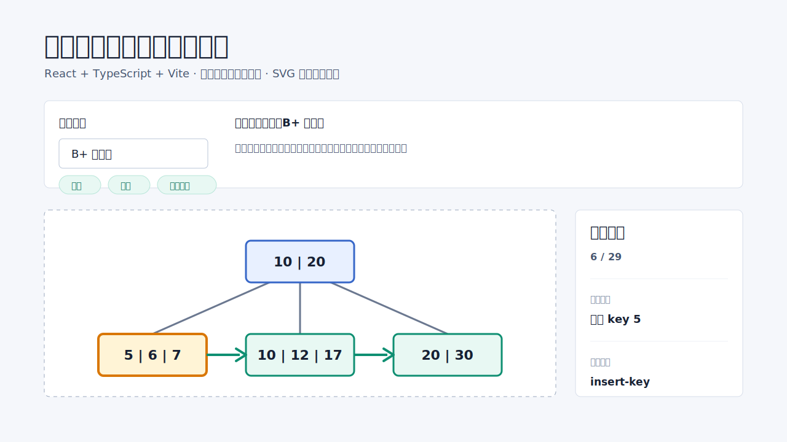

# 数据库索引结构可视化工具

一个使用 **AI Coding 辅助开发** 的数据库索引结构可视化项目。项目基于 React + TypeScript + Vite 构建，使用 SVG 和事件驱动动画展示五种典型数据库索引结构的插入、查找与范围查询过程。

在线体验：[https://database-index-visualizer.vercel.app/](https://database-index-visualizer.vercel.app/)



## 项目亮点

- 支持五种索引结构：B+ 树、哈希索引、R 树、四叉树、网格索引。
- 设计统一 `IndexEngine` 接口，将核心算法、动画事件、ViewModel 和 SVG 渲染组件解耦。
- 页面层只负责交互编排、状态管理、示例载入和动画播放，不直接实现索引算法。
- 支持插入、查找、范围查询、重置、播放 / 暂停、上一步 / 下一步和动画速度控制。
- 每种索引提供至少 2 个内置演示案例，可直接观看节点分裂、冲突链、MBR 扩张、空间划分、cell 映射和剪枝过程。
- 使用 Vitest 覆盖核心算法、engine 适配、ViewModel 输出和关键动画事件。
- 通过 Vercel 静态部署，不需要后端、数据库或用户系统。

## 支持的索引结构

| 索引结构 | 支持操作 | 可视化重点 |
| --- | --- | --- |
| B+ 树索引 | 插入、查找、范围查询 | 节点访问、叶子链表扫描、节点分裂、key 提升 |
| 哈希索引 | 插入、查找 | `key % bucketCount`、bucket 定位、链地址冲突 |
| R 树索引 | 插入、查找、范围查询 | MBR 扩张、节点分裂、空间相交、剪枝 |
| 四叉树索引 | 插入、查找、范围查询 | 空间划分、象限选择、点重分发、范围剪枝 |
| 网格索引 | 插入、查找、范围查询 | 固定 5x5 网格、cell 映射、cell 剪枝、命中点 |

哈希索引不支持范围查询，页面会禁用该操作并给出说明。

## 技术栈

- React
- TypeScript
- Vite
- SVG
- CSS
- Vitest

项目未引入 D3、React Flow、Cytoscape 等复杂图形库。

## 本地运行

安装依赖：

```bash
npm install
```

启动开发服务器：

```bash
npm run dev
```

运行测试：

```bash
npm test
```

生产构建：

```bash
npm run build
```

本地预览构建产物：

```bash
npm run preview
```

## 部署

本项目是纯前端静态站点，生产构建输出目录为 `dist/`。

Vercel 推荐配置：

```text
Framework Preset: Vite
Build Command: npm run build
Output Directory: dist
Install Command: npm install
Environment Variables: 不需要
```

GitHub Pages 也可以部署。若部署到仓库子路径，需要在 Vite 中配置对应 `base`；部署到根域名或 Vercel 时无需额外配置。

## 项目结构

```text
src/core/common/       统一 IndexEngine、ViewModel、AnimationEvent 类型
src/core/bptree/       B+ 树核心逻辑、engine、ViewModel 和测试
src/core/hash/         哈希索引核心逻辑、engine、ViewModel 和测试
src/core/rtree/        R 树核心逻辑、engine、ViewModel 和测试
src/core/quadtree/     四叉树核心逻辑、engine、ViewModel 和测试
src/core/grid/         网格索引核心逻辑、engine、ViewModel 和测试
src/components/        SVG 可视化组件
src/pages/             首页编排、索引入口、内置示例配置
docs/                  架构说明、AI Coding 过程说明和展示资源
```

## AI Coding 说明

本项目不是“内置 AI 功能”的产品，而是一个 **AI Coding 辅助完成的工程实践项目**。AI 主要参与需求拆解、架构约束梳理、测试补充、文档整理和上线准备；关键功能经过人工验收。

详细过程见：[docs/AI_CODING.md](docs/AI_CODING.md)

## 文档入口

- [架构说明](docs/ARCHITECTURE.md)
- [AI Coding 过程说明](docs/AI_CODING.md)
- [版本记录](CHANGELOG.md)
- [后续规划](ROADMAP.md)
